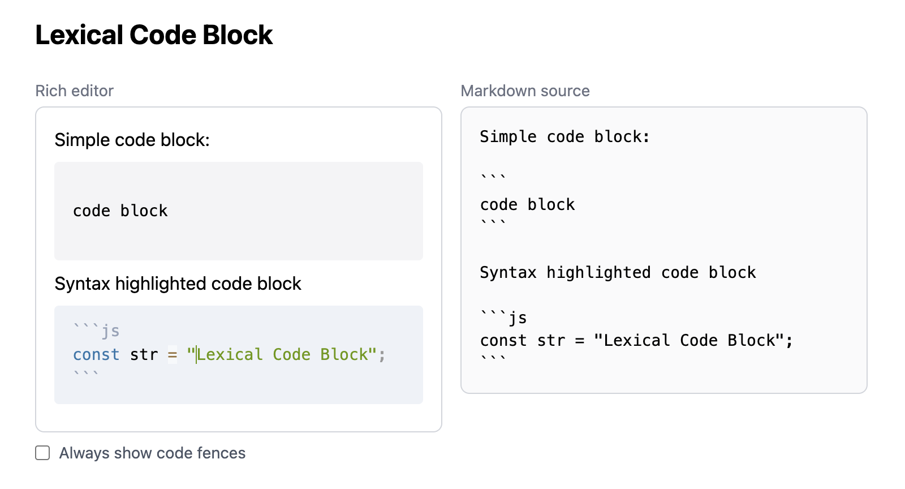

# etude-lexical-code-block

> [!NOTE]
> **This repository is no longer maintained.** Development has been consolidated into [dayflower/etude-lexical-markdown](https://github.com/dayflower/etude-lexical-markdown). Please refer to that repository for the latest work.

A personal study project implementing Markdown-style code block editing logic in [Lexical](https://lexical.dev/).

Live demo: https://dayflower.github.io/etude-lexical-code-block/

## About

This is an etude — a hands-on exercise for learning, not a production tool. Building anything non-trivial with Lexical turns out to be surprisingly involved, so this project exists as a record of that exploration.

The editor behavior is loosely inspired by Obsidian's editor, but is not identical to it. The logic was written independently from scratch.

## Features

The UI is a dual-panel layout: a rich editor on the left and a live Markdown source preview on the right.

## Implementation Notes

## License

[MIT](LICENSE)
